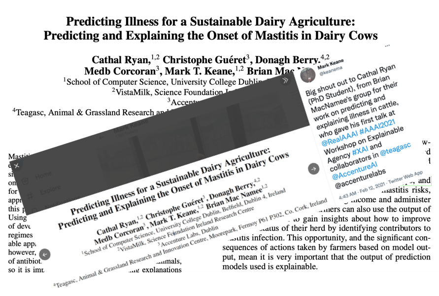
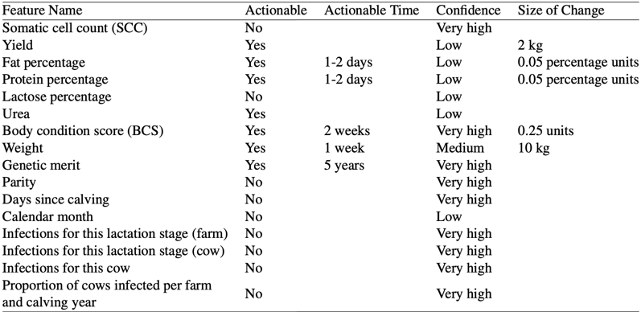
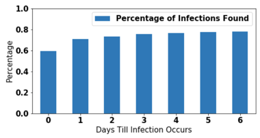
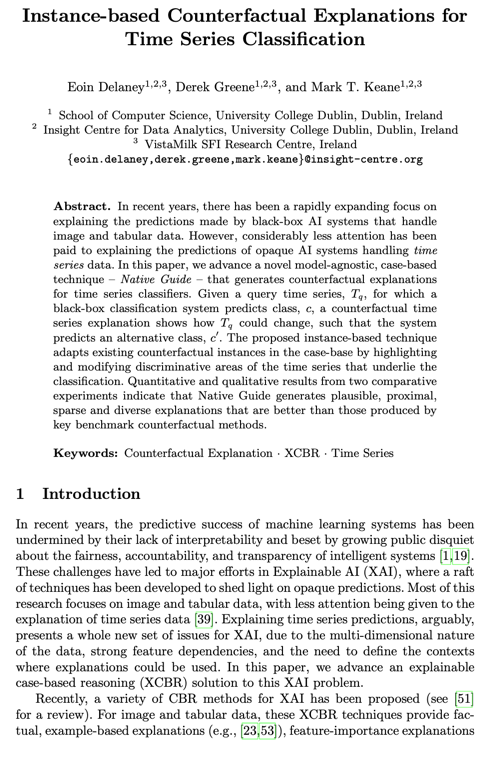

```{r xaringan-themer, include = FALSE, warning=FALSE}
library(xaringanthemer)
style_duo_accent(
  primary_color = "#002F6C",
  secondary_color = "#FFC600",
  inverse_header_color = "#FFFFFF",
  header_font_google = google_font("Josefin Sans"),
  text_font_google   = google_font("Montserrat", "300", "300i"),
  code_font_google   = google_font("Droid Mono"),
)
```

# Objectives

- Who is Mark T. Keane?

- Understand foundations of sustainable dairy farming research

- Identify key methods in dairy farming CBR system

- Discuss ICCBR 2021 work on counterfactual explanations


---
class: inverse center middle

# Who is this guy?


---
class: split-25 white center
layout: false

row.white[
# A Cognitive Scientist
]

.row[
.split-three[
.column[.content[
.center[
## Professor & Chair
]


.red[*14k (Google Scholar)]
]]

.column[.content[
## Author


]]

.column[.content[
## Grows Garlic

 

]]

]]

???
Mark Keane is a cognitive computer scientist. HE is Professor and Chair of Computer Science and UCD.14k+ citations (Google Scholar). He an expert in the cognitive sciences - having written several books, like Cognitive Psychology: A Student's Handbook, Advances in the Psychological Thinking. His expertise is also split in the computer sciences - where he focuses on topics like NLP, machine learning, CBR, text analytics and XAI.

---
## Predicting Sickness in Dairy Cows

.pull-left[
- classifier system to predict mastitis in dairy cows

- predict if a cow will become infected or heal within 7 days
  - end-to-end system using stakeholder input
  - reasonings included features that are actionable
  
- data source: 7 dairy farms across Ireland (2010-2019) ~ 2,300 cows

- model: gradient boosting classifier
  - outcome: days until infection
  
- conclusion: even ~70% accuracy would greatly benefit
]

.pull-right[


]
???
Keane's team gave a workshop talk on this paper at this years AAAI conference.
mastitis = infections in the utter which costs billions in waste 
rationale:farmers find infection to late due to lack of skill thus raising risk in spread/extend length of sickness
system: end-to-end classification system using stakeholder input. reasonings include features that are actionable which increases user acceptance. they also needed to assure that the system performed at an accuracy level acceptable to stakeholders. to do that, they made sure get feedback received from farmers and veterinarians while building the system on specific accuracy measures for classifying a healthy milking vs infectious, how much time is needed to communicate to the farmer that a cow is at risk of infection and which features are actually actionable for the farmers and their confidence levels.
data: contained details on milking procedures(total amount of milk produced each day) as well as mastitis (how and when the cow was infected)

model: gradient boosting classifier with levels being a healthy milking in the next 7 days or an infected milking
conclusion: vet also input that even a 12 hour notice could give a farmer enough time to isolate the sick cow


---
## Break it Down

.pull-left[

- In the CBR context
  - set of analytic tasks - classification
- Propensity model
  - predict likelihood that a cow will develop mastitis in the next 7 days
- Gradient Boosting 
  - training set - data from 2010-2018
  - test set - data from 2018-2019
  - determine which cow belong in each day
- Use of counterfactuals
  - *positive class* = prediction that a cow will be infected
  - use of nearest unlike neighbors
  - *If cow #42 had an increase of one and a half units with respect to Yield she would be likely to succumb to mastitis.*
]

.pull-right[




]
???
here has been work done on predicting illness in cows however none have been coupled with explanations to allow for more actionable decisions. This paper uses counterfactuals to explain the causal importance of a set of features that are both actionable and confidence building as its been shown that people, psychologically, can more naturally understand the causal roles of a feature had it been different.

After data were collected, a propensity model was developed to predict likelihood that a cow will develop mastitis in the next 7 days. for those that aren't familiar with propensity modeling - propensity modeling is a way to identify who or what in your sample are more likely to make a purchase, receive a certain treatment or in this case get infected. it involves calculating probabilities on a subset of the sample that have been "exposed" or present with a known characteristic to the outcome, given a set of confounding variables, on each patient. the point is to eliminate some of the confounding bias for all observed covariates. 

on GB: a machine learning technique for regression, classification and other tasks, which produces a prediction model in the form of an ensemble of weak prediction models, typically decision trees.

counterfactuals: given the binary classification model- the team aimed to derive the positive class - the prediction that a cow will get infected with explanations. they set a constraint on no more than three features - that are actionable (milk yield) and confidence building (SCC)

Comments:
The methods are a bit unclear - were the propensity scores includes in the model or were the trees split on propensity? 

"pg.68 When these methods can be applied successfully, they are hard to beat." is this a CBR application?
---
## Counterfactual Explanations for Time Series Classification

.pull-left[

]

.pull-right[

]
---

## References

```{r, load_refs, echo=FALSE, message=FALSE}
library(RefManageR)
bib <- ReadBib("./assets/abs-2101-02188.bib", check = FALSE)
ui <- "- "
```

```{r, print_refs, results='asis', echo=FALSE, warning=FALSE, message=FALSE}
writeLines(ui)
print(bib[key = "DBLP:journals/corr/abs-2101-02188"], 
  .opts = list(check.entries = FALSE, 
               style = "html", 
               bib.style = "authoryear"))
```

- Richter M.M., Weber R.O. (2013) Conversational CBR. In: Case-Based Reasoning. Springer, Berlin, Heidelberg. https://doi.org/10.1007/978-3-642-40167-1_20

