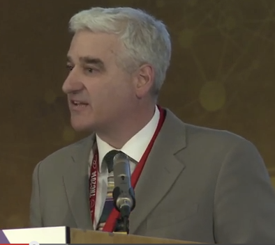
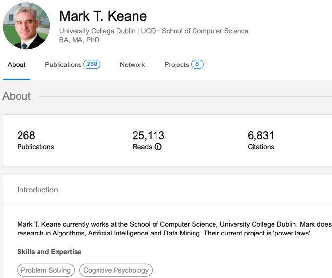
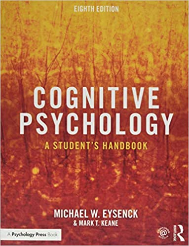
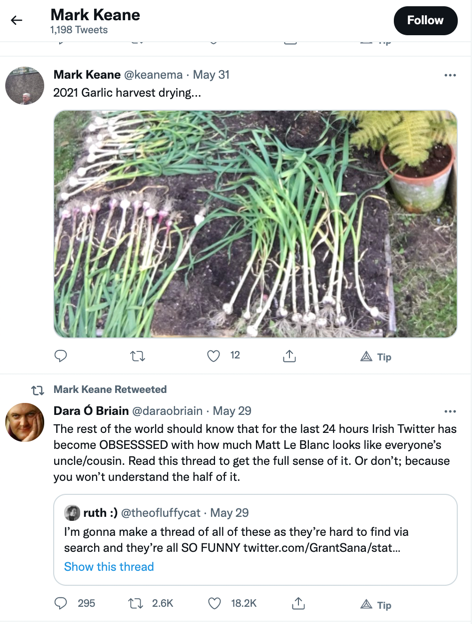

```{r xaringan-themer, include = FALSE, warning=FALSE}
library(xaringanthemer)
style_duo_accent(
  primary_color = "#002F6C",
  secondary_color = "#FFC600",
  inverse_header_color = "#FFFFFF",
  header_font_google = google_font("Josefin Sans"),
  text_font_google   = google_font("Montserrat", "300", "300i"),
  code_font_google   = google_font("Droid Mono"),
)
```

# Objectives

- Who is Mark T. Keane?

- Understand foundations of sustainable dairy farming research

- Identify key methods in dairy farming CBR system

- Discuss ICCBR 2021 work on counterfactual explanations


---
class: inverse center middle

# Who is this guy?



---
class: split-25 white center
layout: false

row.white[
# A Cognitive Scientist
]

.row[
.split-three[
.column[.content[
.center[
## Professor & Chair
]



.red[*14k (Google Scholar)]
]]

.column[.content[
## Author



]]

.column[.content[
## Grows Garlic

 

]]

]]

???
Mark Keane is a cognitive computer scientist. HE is Professor and Chair of Computer Science and UCD.14k+ citations (Google Scholar). He an expert in the cognitive sciences - having written several books, like Cognitive Psychology: A Student's Handbook, Advances in the Psychological Thinking. His expertise is also split in the computer sciences - where he focuses on topics like NLP, machine learning, CBR, text analytics and XAI.

---

## References

```{r, load_refs, echo=FALSE, message=FALSE}
library(RefManageR)
bib <- ReadBib("./assets/S0933365711000480.bib", check = FALSE)
ui <- "- "
```

```{r, print_refs, results='asis', echo=FALSE, warning=FALSE, message=FALSE}
writeLines(ui)
print(bib[key = "MCSHERRY201159"], 
  .opts = list(check.entries = FALSE, 
               style = "html", 
               bib.style = "authoryear"))
```

- Richter M.M., Weber R.O. (2013) Conversational CBR. In: Case-Based Reasoning. Springer, Berlin, Heidelberg. https://doi.org/10.1007/978-3-642-40167-1_20

- Gu, M., Aamodt, A.: Dialog learning in conversational cbr. In: Proceedings ofthe 19th International Florida Artificial Intelligence Research Society Conference,Florida, USA, AAAI Press (2006) 358–363 

- Branting K., Lester J., Mott B. (2004) Dialogue Management for Conversational Case-Based Reasoning. In: Funk P., González Calero P.A. (eds) Advances in Case-Based Reasoning. ECCBR 2004. Lecture Notes in Computer Science, vol 3155. Springer, Berlin, Heidelberg. https://doi.org/10.1007/978-3-540-28631-8_7